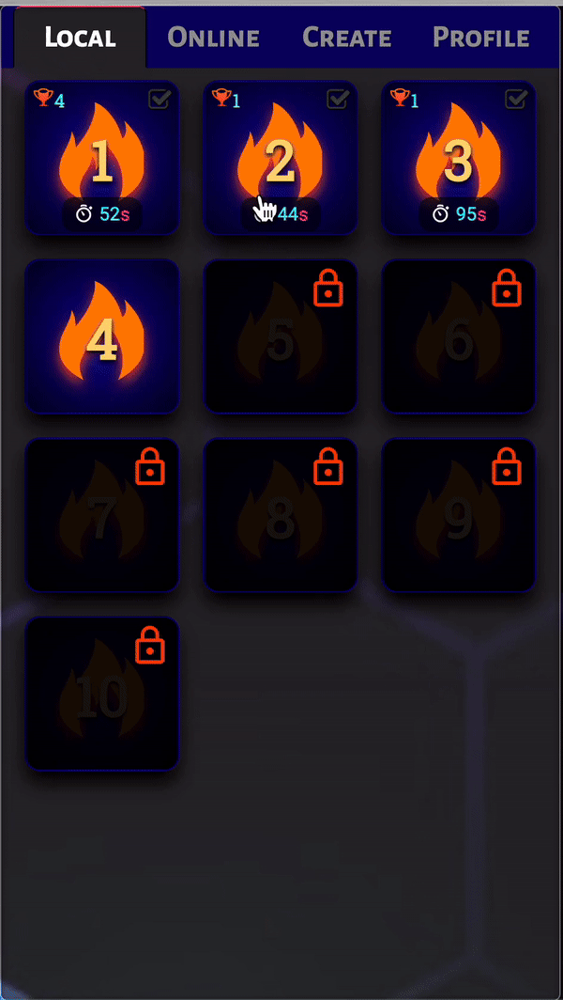
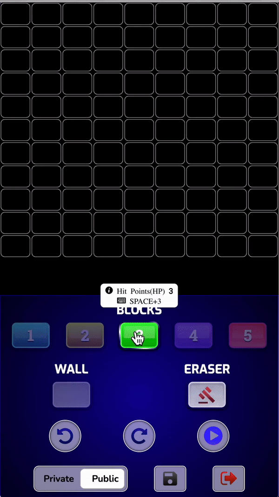

# Breakout Ball Game

## Overview

Breakout Ball is a classic arcade-style game where players control a paddle to bounce a ball and break blocks. This repository contains the source code for the game, developed using WebAssembly, C++, JavaScript, HTML, CSS, and Firebase Database.

## Features

-  Classic breakout gameplay with modern twists.
-  Create custom levels and save them publicly or privately.
-  Gyroscope controls for immersive gameplay.
-  Control sound volume and vibration settings.
-  Support for touch-based and keyboard/mouse controls.
-  Dynamic level ranking system.

# Technical Challenges and Optimizations

-  ### Developing Breakout Ball involved overcoming several technical challenges to ensure smooth gameplay and efficient performance:

WebAssembly and C++: Implementing the game logic in C++ and compiling it to WebAssembly provided significant performance benefits compared to pure JavaScript. However, integrating WebAssembly with JavaScript required careful optimization to minimize overhead and ensure seamless execution.
Collision Detection: Implementing efficient collision detection algorithms for block collisions was crucial for responsive gameplay and realistic physics. Utilizing techniques like AABB (Axis-Aligned Bounding Box) collision detection helped optimize performance while maintaining accuracy.
Gameplay Optimization: Fine-tuning game mechanics such as ball movement speed, paddle responsiveness, and block layout was essential for balanced and enjoyable gameplay. Iterative testing and optimization were conducted to achieve optimal difficulty progression and player engagement.
Playing the Game.

## Level Creation

Navigate to the Level Editor: Within the game, locate the level editor feature.
Customize Your Level: Place blocks, adjust settings, and design your custom level.
Save Your Level: Choose to save your level either publicly or privately.
Gameplay Controls

Touch Controls: Swipe to move the paddle.
Keyboard/Mouse Controls: Use arrow keys or mouse movement to control the paddle.
Screenshots

## Screenshot

<table>
  <tr>
    <td>
      <h4>Overview</h4>
      
    </td>
    <td>
      <h4>Game Play</h4>
      
    </td>
  </tr>
  <tr>
    <td>
      <h4>Creating Level</h4>
      
    </td>
    <td>
      <h4>Level Modification</h4>
      
    </td>
  </tr>
</table>

## Ranking System

Levels are ranked based on completion time.
Compete with other players to reach the top of the leaderboard.

## Compatibility

Compatible with modern web browsers on desktop and mobile devices.
Touch controls optimized for mobile gameplay.
Contributing

Thank you for considering contributing to Breakout Ball! If you'd like to contribute, please fork the repository and submit a pull request.

## License

This project is licensed under the [MIT License](./MIT-LICENSE.txt).

## Contact

For questions or feedback, please contact me

-  [Email](https://elsesourav@gmail.com)

-  [Twitter](#https://twitter.com/elsesourav)

-  [Linkedin](#https://linkedin.com/in/elsesourav)

-  [Facebook](#https://fb.com/elsesourav)

-  [Instagram](#https://instagram.com/elsesourav)
